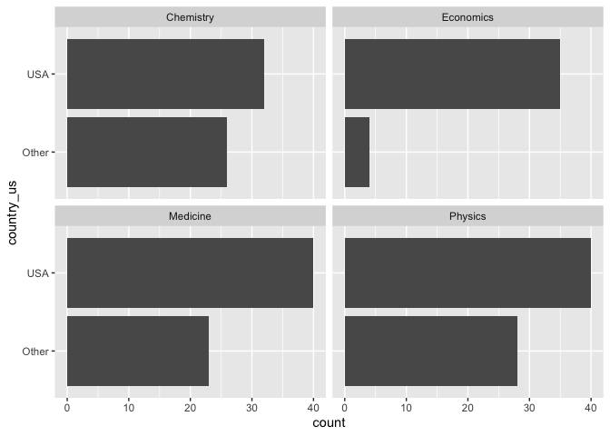

Lab 03 - Nobel laureates
================
Elayna
2/3/21

### Load packages and data

``` r
library(tidyverse) 
```

``` r
nobel <- read_csv("data/nobel.csv")
```

## Exercises

### Exercise 1

``` r
##nobel %>% 
  ##filter( !is.na(country),
    ##     gender != "org" ,
      ##   is.na(died_date))

##nobel_living <- (nobel [!is.na("country") , 
  ##                             "gender" != "org" , 
    ##                           is.na("died_date")])
```

``` r
nobel_living <- nobel %>% 
  filter(!is.na(country),
         gender != "org" ,
         is.na(died_date))
```

### Exercise 2

``` r
nobel_living <- nobel_living %>% 
  mutate(
    country_us = if_else(country == "USA" , "USA" , "Other")
  )

nobel_living_science <- nobel_living %>% 
  filter(category %in% c("Physics" , "Medicine" , "Chemistry" , "Economics"))
```

### Exercise 3

Most living nobel laureates were based in the US when they won their
prize: given the bar plot, this appears to be true.

``` r
#nobel_living_science is data for currently living nobel prize winners in #one of the sciences (physics, medicine, chem, econ) who are categorized #as winning while living in the US or elsewhere

ggplot(data = nobel_living_science, aes( x = country_us)) +
  geom_bar() +
  facet_wrap(~category) +
  coord_flip()
```

<!-- -->

### Exercise 4

…

### Exercise 5

…

### Exercise 6

…
