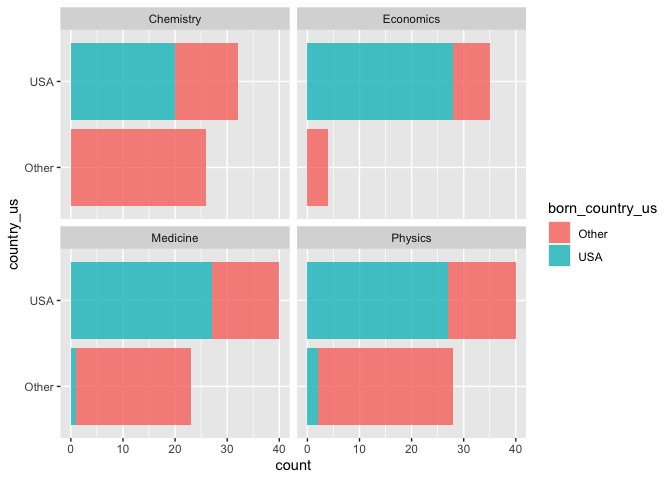

Lab 03 - Nobel laureates
================
Elayna
2/3/21

### Load packages and data

``` r
library(tidyverse) 
```

``` r
nobel <- read_csv("data/nobel.csv")
```

## Exercises

### Exercise 1

``` r
##nobel %>% 
  ##filter( !is.na(country),
    ##     gender != "org" ,
      ##   is.na(died_date))

##nobel_living <- (nobel [!is.na("country") , 
  ##                             "gender" != "org" , 
    ##                           is.na("died_date")])
```

### take 2 for Ex 1

``` r
nobel_living <- nobel %>% 
  filter(!is.na(country),
         gender != "org" ,
         is.na(died_date))
```

### Exercise 2

``` r
nobel_living <- nobel_living %>% 
  mutate(
    country_us = if_else(country == "USA" , "USA" , "Other")
  )

nobel_living_science <- nobel_living %>% 
  filter(category %in% c("Physics" , "Medicine" , "Chemistry" , "Economics"))
```

### Exercise 3

Most living nobel laureates were based in the US when they won their
prize: given the bar plot, this appears to be true.

#nobel_living_science is data for currently living nobel prize winners
in one of the sciences (physics, medicine, chem, econ) who are
categorized as winning the prize while living in the US or elsewhere

``` r
ggplot(data = nobel_living_science, aes( x = country_us)) +
  geom_bar() +
  facet_wrap(~category) +
  coord_flip()
```

<!-- -->

### Exercise 4

105 were born in the USA, 123 were born elsewhere.

``` r
nobel_living_science <- nobel_living_science %>% 
  mutate(
    born_country_us = if_else(born_country == "USA" , "USA" , "Other")
  )

nobel_living_science %>% 
  filter(born_country_us == "Other")
```

    ## # A tibble: 123 × 28
    ##       id firstname surname   year category affiliation  city  country born_date 
    ##    <dbl> <chr>     <chr>    <dbl> <chr>    <chr>        <chr> <chr>   <date>    
    ##  1    68 Chen Ning Yang      1957 Physics  Institute f… Prin… USA     1922-09-22
    ##  2    69 Tsung-Dao Lee       1957 Physics  Columbia Un… New … USA     1926-11-24
    ##  3    97 Leo       Esaki     1973 Physics  IBM Thomas … York… USA     1925-03-12
    ##  4    98 Ivar      Giaever   1973 Physics  General Ele… Sche… USA     1929-04-05
    ##  5    99 Brian D.  Josephs…  1973 Physics  University … Camb… United… 1940-01-04
    ##  6   101 Antony    Hewish    1974 Physics  University … Camb… United… 1924-05-11
    ##  7   111 Arno      Penzias   1978 Physics  Bell Labora… Holm… USA     1933-04-26
    ##  8   124 Carlo     Rubbia    1984 Physics  CERN         Gene… Switze… 1934-03-31
    ##  9   126 Klaus     von Kli…  1985 Physics  Max-Planck-… Stut… Germany 1943-06-28
    ## 10   128 Gerd      Binnig    1986 Physics  IBM Zurich … Rüsc… Switze… 1947-07-20
    ## # … with 113 more rows, and 19 more variables: died_date <date>, gender <chr>,
    ## #   born_city <chr>, born_country <chr>, born_country_code <chr>,
    ## #   died_city <chr>, died_country <chr>, died_country_code <chr>,
    ## #   overall_motivation <chr>, share <dbl>, motivation <chr>,
    ## #   born_country_original <chr>, born_city_original <chr>,
    ## #   died_country_original <chr>, died_city_original <chr>, city_original <chr>,
    ## #   country_original <chr>, country_us <chr>, born_country_us <chr>

### Exercise 5

``` r
ggplot(data = nobel_living_science, aes( x = country_us , 
                                         fill = born_country_us)) +
  geom_bar( alpha = .8) +
  facet_wrap(~category) +
  coord_flip()
```

<!-- -->

### Exercise 6

Most scientists who immigrate are from Germany or the United Kingdom.

``` r
nobel_living_science %>% 
  filter(born_country != "USA" ,
         country == "USA") %>% 
  count(born_country) %>% 
  arrange(desc(n))
```

    ## # A tibble: 21 × 2
    ##    born_country       n
    ##    <chr>          <int>
    ##  1 Germany            7
    ##  2 United Kingdom     7
    ##  3 China              5
    ##  4 Canada             4
    ##  5 Japan              3
    ##  6 Australia          2
    ##  7 Israel             2
    ##  8 Norway             2
    ##  9 Austria            1
    ## 10 Finland            1
    ## # … with 11 more rows
